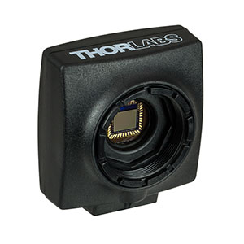

# ThorlabsDCC1545M



The [Thorlabs DCC 1545M](https://www.thorlabs.com/newgrouppage9.cfm?objectgroup_id=4024) is a 1.3 Megapixel (1280 x 1024 Pixels) monochrome camera with CMOS sensor. This package wraps the pyueye python library to communicate with the camera through julia.

Author: Markus Petters (mdpetter@ncsu.edu)

## Installation

```julia
pkg> add https://github.com/mdpetters/ThorlabsDCC1545M.jl.git
```

The package depend on PyCall for julia/python interoperability. The python distribution used by the PyCall must have the following dependencies installed.

- [pyueye](https://pypi.org/project/pyueye/)
- [opencv](https://pypi.org/project/opencv-python/)
- [numpy](https://pypi.org/project/numpy/)
 
## Usage

The basic usage is simple and allows for moderately high frequency streaming. To modify specific camera settings please see pyueye API documentaion and the package source code.

```julia
# Loads the package and initializes the first found camera
using ThorlabsDCC1545M

# capture the image
image = ThorlabsDCC1545M.capture()
```